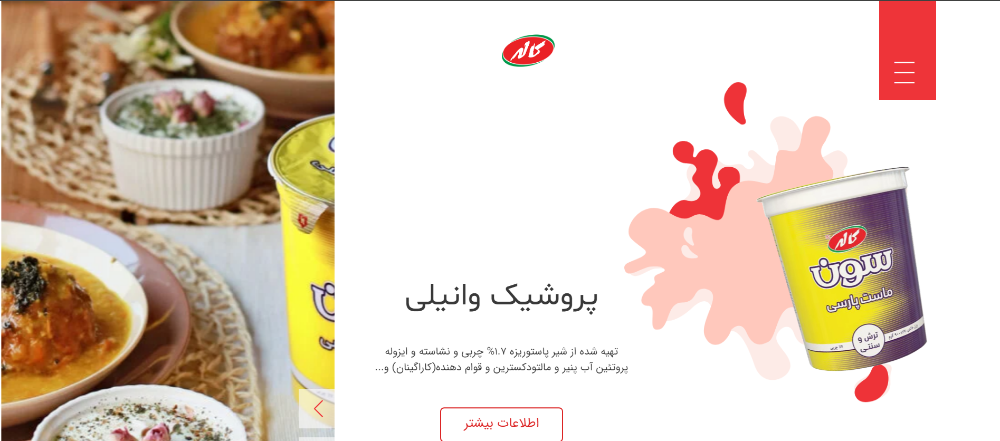

                         
 

<h3 align="center">Kalle website</h3>

kalle  is amazing  website
 
 
<a href="https://github.com/rmrady/kalle_websid"><strong>Explore the docs »</strong></a>

  

 ## About The Project

In my opinion, the Kalle website is one of the best Persian websites that has all the effects and sliders and is a very good site for practice. I designed this site with my friends and we had a lot of fun.
 ### Built With

this website build with:

- [html](https://html.com)
- [css](https://css.com)
- [sass](https://sass.com)
- [tailwind](https://tailwindcss.com)
- [javascript](https://javascript.com)
 ## Contact

Your Name -(Arshia Farrokhi  and Tabasom and Razieh moradi)

Project Link: https://github.com/rmrady/kalle_websid
